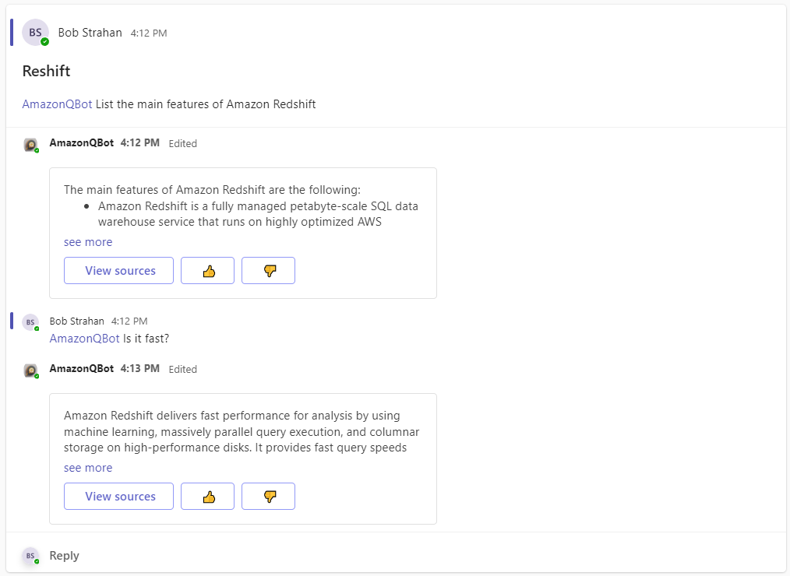

# Microsoft Teams gateway for Amazon Q, your business expert (preview)

Amazon Q is a new generative AI-powered application that helps users get work done. Amazon Q can become your tailored business expert and let you discover content, brainstorm ideas, or create summaries using your company’s data safely and securely. For more information see: [Introducing Amazon Q, a new generative AI-powered assistant (preview)](https://aws.amazon.com/blogs/aws/introducing-amazon-q-a-new-generative-ai-powered-assistant-preview)

In this repo we share a project which lets you use Amazon Q's generative AI to enable Microsoft Teams members  to access your organizations data and knowledge sources via conversational question-answering. You can connect to your organization data via data source connectors and integrate it with Teams Gateway for Amazon Q to enable access to your Teams channel members. It allows your users to:
- Converse with Amazon Q using Teams Direct Message (DM) to ask questions and get answers based on company data, get help creating new content such as emails, and performing tasks. 
- You can also invite it to participate in your team channels. 
  - In a channel users can ask it questions in a new message, or tag it in a thread at any point. Get it to provide additional data points, resolve a debate, or summarize the conversation and capture next steps. 

It's amazingly powerful. Here's a demo - seeing is believing!
 

TODO - Make video

It's easy to deploy in your own AWS Account, and add to your own teams. We show you how below.

### Features
- In DMs it responds to all messages **DONE**
- Renders answers containing markdown - e.g. headings, lists, bold, italics, tables, etc. **(This works natively)**
---
- In channels it responds only to @mentions, and always replies in thread **TODO**
- Provides thumbs up / down buttons to track user sentiment and help improve performance over time **TODO**
- Provides Source Attribution - see references to sources used by Amazon Q **TODO**
- Aware of conversation context - it tracks the conversation and applies context **TODO**
- Aware of multiple users - when it's tagged in a thread, it knows who said what, and when - so it can contribute in context and accurately summarize the thread when asked.  **TODO**
- Process up to 5 attached files for document question answering, summaries, etc. **TODO**
- Reset and start new conversation in DM channel by using `/new_conversation` **TODO**

This sample Amazon Q Teams application is provided as open source — use it as a starting point for your own solution, and help us make it better by contributing back fixes and features via GitHub pull requests. Explore the code, choose Watch to be notified of new releases, and check back for the latest  updates.

  #TODO

Follow the instructions below to deploy the project to your own AWS account and Teams, and start experimenting!

## Deploy the solution

### Prerequisites

You need to have an AWS account and an IAM Role/User with permissions to create and manage the necessary resources and components for this application. *(If you do not have an AWS account, please see [How do I create and activate a new Amazon Web Services account?](https://aws.amazon.com/premiumsupport/knowledge-center/create-and-activate-aws-account/))*

You also need to have an existing, working Amazon Q application. If you haven't set one up yet, see [Creating an Amazon Q application](https://docs.aws.amazon.com/amazonq/latest/business-use-dg/create-app.html)

### 1. Deploy the stack

We've made this easy by providing pre-built AWS CloudFormation templates that deploy everything you need in your AWS account.

If you are a developer, and you want to build, deploy and/or publish the solution from code, we've made that easy too! See [Developer README](./README_DEVELOPERS.md)

1. Log into the [AWS console](https://console.aws.amazon.com/) if you are not already.
2. Choose one of the **Launch Stack** buttons below for your desired AWS region to open the AWS CloudFormation console and create a new stack.
4. Enter the following parameters:
    1. `Stack Name`: Name your App, e.g. AMAZON-Q-SLACK-GATEWAY.
    2. `AmazonQAppId`: Your existing Amazon Q Application ID (copy from Amazon Q console). 
    3. `AmazonQRegion`: Choose the region where you created your Amazon Q Application.
    4. `AmazonQUserId`: (Optional) Amazon Q User ID email address (leave empty to use Slack users email as user Id) **REQUIRED CURRENTLY**
    5. `ContextDaysToLive`: Just leave this as the default (90 days)

Region | Easy Deploy Button | Template URL - use to upgrade existing stack to a new release
--- | --- | ---
N. Virginia (us-east-1) |  | https://s3.us-east-1.amazonaws.com/aws-ml-blog-us-east-1/artifacts/amazon-q-slack-gateway/AmazonQSlackGateway.json
Oregon (us-west-2) |  | https://s3.us-west-2.amazonaws.com/aws-ml-blog-us-west-2/artifacts/amazon-q-slack-gateway/AmazonQSlackGateway.json

When your CloudFormation stack status is CREATE_COMPLETE, choose the **Outputs** tab, and keep it open - you'll need it below.

### 2. Configure your Teams bot application

#### 2.1 Register a new app in the Microsoft Azure portal

1. Go to the Azure Portal: https://portal.azure.com/#blade/Microsoft_AAD_RegisteredApps/ApplicationsListBlade
1. Choose **+ New registration**
    1. For **Name**, provide the name for your app. *Tip: Keep things simple by using the `Stack Name` you entered above.*
    1. For **Who can use this application or access this API?**, choose **Accounts in any organizational directory (Any Microsoft Entra ID tenant 1. Multitenant)**
    1. Choose **Register**
    1. *Note down the **Application (client) ID** value, from the **Overview** page. You'll need it later when asked for **MicrosoftAppId**.*
1. In the **Select API permissions** page (on the left navigation menu)
    1. Choose **Add a permission**
    1. Choose **Microsoft Graph**
    1. Choose **Application permissions**
    1. Select **User.Read.All**
    1. Choose **Add permissions**. *This permission allows the app to read data in your organization's directory about the signed in user.*
    1. Remove the original **User.Read - Delegated** permission (use the … menu on the right to choose **Remove permission**)
    1. Choose **✓ Grant admin consent for Default Directory**
1. In the **Certificates & secrets** page
    1. Choose **+ New client secret**
    1. For **Description**, provide a value such as *<Appname>-client-secret*
    1. Choose a value for **Expires**. *NOTE: In production, you'll need to manually rotate your secret before it expires.* 
    1. Choose **Add**
    1. *Note down the **Value** for your new secret. You'll need it later when asked for **MicrosoftAppPassword**.*
1. (Optional) Choose **Owners** to add any additional owners for the application.

#### 2.2 Register your new app in the Microsoft Bot Framework

1. Go to the Microsoft Bot Framework: https://dev.botframework.com/bots/new
1. (Optional) Create and upload a cool custom icon for your new Amazon Q Bot. Or, use this one that I created using [Amazon Bedrock image playgound](https://us-east-1.console.aws.amazon.com/bedrock/home?region=us-east-1#/image-playground?modelId=stability.stable-diffusion-xl-v1)!  

1. Enter your prefered **Display name**, **Bot handle**, and **Long description**.
1. For **Messaging endpoint** copy and paste the value of the `TeamsEventHandlerApiEndpoint` from your Stack outputs tab (from Step 1).  *Do not check Enable Streaming Endpoint*
1. For **Paste your app ID below to continue**, enter the *MicrosoftAppId* value you noted above.
1. Leave the other values as is, agree to the terms, and choose **Register**.
1. On the **Channels** page, under **Add a featured channel** choose **Microsoft Teams** 
1. Choose **Microsoft Teams Commercial (most common)**, and then **Save**.
1. Agree to the Terms of Service and choose **Agree**

### 3. Configure your Secrets in AWS

Let's configure your App secrets in order to (1) verify the signature of each request, (2) post on behalf of your bot

> **IMPORTANT**
> In this example we are not enabling app secret rotation. Enable it for a production app by implementing
> rotation via AWS Secrets Manager. 
> Please create an issue (or, better yet, a pull request!) in this repo if you want this feature added to a future version.

1. Login to your AWS console
2. In your AWS account go to Secret manager, using the URL shown in the stack output: `TeamsSecretConsoleUrl`.
3. Choose `Retrieve secret value`
4. Choose `Edit`
5. Replace the value of `MicrosoftAppId` and `MicrosoftAppPassword` with the values you noted in the previous steps.
6. Choose **Save**

### 4. Finally, deploy into Microsoft Teams

1. Go to Developer Portal for Teams: https://dev.teams.microsoft.com/home
1. Choose **+ New app**
    1. For **Name**, enter your bot name.
    1. Enter **Full name** and both short and full **Descriptions** *(you can just use the bot name for them all if you want - just don't leave them empty)*
    1. Enter values for **Developer information** and **App URLs** fields.
        1. *For testing, you can make up values, and URLs like `https://www.anycompany.com/` etc. Use real ones for production.*
    1. For **Application (client) ID*** enter the value of `MicrosoftAppId` from above.
    1. Choose **Save**.
1. Under **Branding** you can upload my AI generated icons, or different icon(s), or none at all.. it's up to you.
    - [Color icon 192x192](./images/QBotIcon.png) / [Outline icon 32x32](./images/QBotIcon-small.png)   
    
1. Under **App features**, choose **Bot**
    1. Select **Enter a bot ID**, and enter the `MicrosoftAppId` from the earlier steps
    1. Under **What can your bot do?**, check **Upload and download files**.
    1. Under **Select the scopes in which people can use this command**, check all 3 boxes (**Personal**, **Team**, and **Group chat**).
    1. Choose **Save**
1. Choose **Publish**
    1. Choose **Download the app package** to download a zip file to your computer.
1. Choose **Preview in Teams** to **Microsoft Teams (work or school)** app 
    1. From the Microsoft Teams left navigation bar, choose **Apps**, then **Manage your apps**, then **⤒ Upload an app**
    1. Choose **Upload an app to your orgs app catalog**, and select the zip file downloaded in the previous step. This adds the app to Teams.
    1. Select the card for your new app and choose **Add**.

And, now, at least, you can test your bot in Microsoft Teams!

### Say hello
> Time to say Hi!

1. Go to Slack
2. Under Apps > Manage, add your new Amazon Q app
3. Optionally add your app to team channels
4. In the app DM channel, say *Hello*. In a team channel, ask it for help with an @mention.
5. Enjoy.

## Contributing, and reporting issues

We welcome your contributions to our project. Whether it's a bug report, new feature, correction, or additional
documentation, we greatly value feedback and contributions from our community.

See [CONTRIBUTING](CONTRIBUTING.md) for more information.

## Security

See [Security issue notifications](CONTRIBUTING.md#security-issue-notifications) for more information.

## License

This library is licensed under the MIT-0 License. See the [LICENSE](./LICENSE) file.