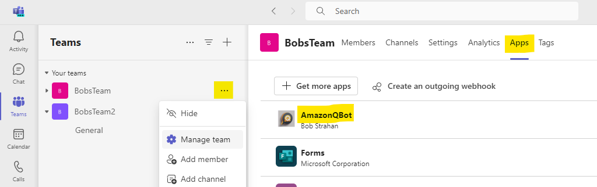

# Developer README

The main README is here: [Microsoft Teams gateway for Amazon Q, your business expert (preview)](./README.md)

This Developer README describes how to build the project from the source code - for developer types. You can:
- [Deploy the solution](#deploy-the-solution)
- [Publish the solution](#publish-the-solution)

### 1. Dependencies

To deploy or to publish, you need to have the following packages installed on your computer:

1. bash shell (Linux, MacOS, Windows-WSL)
2. node and npm: https://docs.npmjs.com/downloading-and-installing-node-js-and-npm
3. tsc (typescript): `npm install -g typescript`
4. esbuild: `npm i -g esbuild`
5. jq: https://jqlang.github.io/jq/download/
6. aws (AWS CLI): https://docs.aws.amazon.com/cli/latest/userguide/getting-started-install.html
7. cdk (AWS CDK): https://docs.aws.amazon.com/cdk/v2/guide/cli.html

Copy the GitHub repo to your computer. Either:
- use the git command: git clone https://github.com/aws-samples/amazon-q-teams-gateway.git
- OR, download and expand the ZIP file from the GitHub page: https://github.com/aws-samples/amazon-q-teams-gateway/archive/refs/heads/main.zip

### 2. Prerequisites

1. You need to have an AWS account and an IAM Role/User with permissions to create and manage the necessary resources and components for this application. *(If you do not have an AWS account, please see [How do I create and activate a new Amazon Web Services account?](https://aws.amazon.com/premiumsupport/knowledge-center/create-and-activate-aws-account/))*

2. You need to have an Okta Workforce Identity Cloud account. If you haven't signed up yet, see [Signing up for Okta](https://www.okta.com/)

3. You need to configure SAML and SCIM with Okta and IAM Identity Center. If you haven't configured, see [Configuring SAML and SCIM with Okta and IAM Identity Center](https://docs.aws.amazon.com/singlesignon/latest/userguide/gs-okta.html)

4. You also need to have an existing, working Amazon Q business application integrated with IdC. If you haven't set one up yet, see [Creating an Amazon Q application](https://docs.aws.amazon.com/amazonq/latest/business-use-dg/create-app.html)

5. You need to have users subscribed to your Amazon Q business application, and are able to access Amazon Q Web Experience. If you haven't set one up yet, see [Subscribing users to an Amazon Q application](https://docs.aws.amazon.com/amazonq/latest/qbusiness-ug/adding-users-groups.html)

6. You have aws cli latest version installed on your Linux or MacOS system. If you haven't installed yet, see [Installing the AWS CLI version 2](https://docs.aws.amazon.com/cli/latest/userguide/install-cliv2.html)

7. Lastly, you need a [Microsoft account](https://account.microsoft.com/) and a [Microsoft Teams subscription](https://www.microsoft.com/en-us/microsoft-teams/compare-microsoft-teams-business-options-b) to create and publish the app using the steps below. If you don’t have these, see if your company can create sandboxes for you to experiment, or create a new account and trial subscription as needed to complete the directions below. You will need a Office 365 business subscription for Teams admin privileges. This subscription will also provide a business Microsoft account which will be needed since some steps cannot use an account with a personal email address.

## Deploy the solution

### 1. Setup

#### 1.1 Create an OIDC app integration, for the gateway, in Okta.

Create the client as a ['Web app'](https://help.okta.com/en-us/content/topics/apps/apps_app_integration_wizard_oidc.htm). You will want to enable the 'Refresh Token' grant type, 'Allow everyone in your organization to access', and 'Federation Broker Mode'. Use a placeholder URL, like ```https://example.com```, for the redirect URI, as you will update this later (in step 3).

#### 1.2 Create Trusted token issuer in IAM Identity Center

Create trusted token issuer to trust tokens from OIDC issuer URL using these instructions listed here - https://docs.aws.amazon.com/singlesignon/latest/userguide/using-apps-with-trusted-token-issuer.html.
Or you can run the below script.

For the script, you need to have the OIDC issuer URL and the AWS region in which you have your Q business application. To retrieve the OIDC issuer URL, go to Okta account console, click the left hamburger menu and open Security > API and copy the whole 'Issuer URI'.

The script will output trusted token issuer ARN (TTI_ARN) which you will use in the next step.

```
 export AWS_DEFAULT_REGION=<>
 OIDC_ISSUER_URL=<>
 bin/create-trusted-token-issuer.sh $OIDC_ISSUER_URL
```

#### 1.3 Create Customer managed application in IAM Identity Center

Create customer managed IdC application by running below script.

For the script, you need to have the OIDC client ID, trusted token issuer ARN, and the region in which you have your Q business application. To retrieve the OIDC client ID, go to Okta account console, click the left hamburger menu and open Applications > Applications and click on the application you created in step 1.1. Copy the 'Client ID'. For TTI_ARN, you can use the output from the previous step.

The script will output the gateway IdC application ARN (GATEWAY_IDC_ARN) which you will use in the next step.

```
 export AWS_DEFAULT_REGION=<>
 OIDC_CLIENT_ID=<>
 TTI_ARN=<>
 bin/create-idc-application.sh $OIDC_CLIENT_ID $TTI_ARN
```

### 2. Register a new app in the Microsoft Azure portal

1. Go to the Azure Portal: https://portal.azure.com/#blade/Microsoft_AAD_RegisteredApps/ApplicationsListBlade and login with your Microsoft account.
1. Choose **+ New registration**
   1. For **Name**, provide the name for your app, e.g. AMAZON-Q-TEAMS-GATEWAY.
   1. For **Who can use this application or access this API?**, choose **Accounts in this organizational directory only (AWS only - Single tenant)**
   1. Choose **Register**
   1. *Note down the **Application (client) ID** value, and the **Directory (tenant) ID** from the **Overview** page. You'll need them later when asked for **MicrosoftAppId** and **MicrosoftAppTenantId**.*
1. In the **API permissions** page (on the left navigation menu)
   1. Choose **Add a permission**
   1. Choose **Microsoft Graph**
   1. Choose **Application permissions**
   1. Select **User.Read.All**
   1. Select **ChannelMessage.Read.All**
   1. Select **Team.ReadBasic.All**
   1. Select **Files.Read.All**
   1. Choose **Add permissions**. *This permission allows the app to read data in your organization's directory about the signed in user.*
   1. Remove the original **User.Read - Delegated** permission (use the … menu on the right to choose **Remove permission**)
   1. Choose **✓ Grant admin consent for Default Directory**
1. In the **Certificates & secrets** page
   1. Choose **+ New client secret**
   1. For **Description**, provide a value such as *\<Appname\>-client-secret*
   1. Choose a value for **Expires**. *NOTE: In production, you'll need to manually rotate your secret before it expires.*
   1. Choose **Add**
   1. *Note down the **Value** (not Secret ID) for your new secret. You'll need it later when asked for **MicrosoftAppPassword**.*
1. (Optional) Choose **Owners** to add any additional owners for the application.

### 3. Initialize and deploy the stack

Navigate into the project root directory and, in a bash shell, run:

1. `./init.sh` - checks your system dependencies for required packages (see Dependencies above), sets up your environment file, and bootstraps your cdk environment.
2. `./deploy.sh` - runs the cdk build and deploys or updates a stack in your AWS account, and outputs value that you'll need in the next section:
- url for EventHandler API endpoint
- links to the AWS Secrets Manager secrets

### 4. Update OIDC Client Redirect URL.

Go the app client settings created in IdP (in step 1.1), and update the client signin redirect URL with exported value in Cloudformation stack for the output with suffix `OIDCCallbackEndpointExportedName`.

### 5. Register your new app in the Microsoft Bot Framework

1. Go to the Microsoft Bot Framework: https://dev.botframework.com/bots/new - login with your Microsoft account.
1. (Optional) Create and upload a cool custom icon for your new Amazon Q Bot. Or, use this one that I created using [Amazon Bedrock image playground](https://us-east-1.console.aws.amazon.com/bedrock/home?region=us-east-1#/image-playground?modelId=stability.stable-diffusion-xl-v1)!  
   
1. Enter your prefered **Display name**, **Bot handle**, and **Long description**.
1. For **Messaging endpoint** copy and paste the value suffixed with `TeamsEventHandlerApiEndpoint` from your Stack outputs tab (from Step 1).  *Do not check Enable Streaming Endpoint*.
1. For **App type**, choose `Single Tenant`.
1. For **Paste your app ID below to continue**, enter the *MicrosoftAppId* value you noted above.
1. For **App Tenant ID**, enter the *MicrosoftAppTenantId* value you noted above.
1. Leave the other values as they are, agree to the terms, and choose **Register**.
1. On the **Channels** page, under **Add a featured channel** choose **Microsoft Teams**
1. Choose **Microsoft Teams Commercial (most common)**, and then **Save**.
1. Agree to the Terms of Service and choose **Agree**

### 6. Configure your Secrets in AWS

#### 6.1 Configure your Teams secrets in order to (1) verify the signature of each request, (2) post on behalf of your bot

> **IMPORTANT**
> In this example we are not enabling app secret rotation. Enable it for a production app by implementing
> rotation via AWS Secrets Manager.
> Please create an issue (or, better yet, a pull request!) in this repo if you want this feature added to a future version.

1. Login to your AWS console
2. In your AWS account go to Secret manager, using the URL shown in the stack output suffixed with `TeamsSecretConsoleUrl`.
3. Choose `Retrieve secret value`
4. Choose `Edit`
5. Replace the value of `MicrosoftAppId`, `MicrosoftAppPassword`, and `MicrosoftAppTenantId` with the values you noted in the previous steps.
6. Choose **Save**

#### 6.2 Configure OIDC Client Secret in order to exchange the code for token

1. Login to your AWS console
2. In your AWS account go to Secret manager, using the URL shown in the stack output suffixed with `OIDCClientSecretConsoleUrl`.
3. Choose `Retrieve secret value`
4. Choose `Edit`
5. Replace the value of `OidcClientSecret`, you will find those values in the IdP app client configuration.

### 7. Finally, deploy into Microsoft Teams

1. Go to Developer Portal for Teams: https://dev.teams.microsoft.com/home - login with your Microsoft Teams user account.
1. Choose Apps (left side pane) and then **+ New app**
   1. For **Name**, enter your bot name.
   1. Enter **Full name** and both short and full **Descriptions** *(you can just use the bot name for them all if you want - just don't leave them empty)*
   1. Enter values for **Developer information** and **App URLs** fields.
      1. *For testing, you can make up values, and URLs like `https://www.anycompany.com/` etc. Use real ones for production.*
   1. For **Application (client) ID*** enter the value of `MicrosoftAppId` from above.
   1. Choose **Save**.
1. Under **Branding** you can upload my AI generated icons, or different icon(s), or none at all.. it's up to you.
   - [Color icon 192x192](./images/QBotIcon.png) / [Outline icon 32x32](./images/QBotIcon-small.png)   
     
1. Under **App features**, choose **Bot**
   1. Select **Enter a bot ID**, and enter the `MicrosoftAppId` from the earlier steps
   1. Under **What can your bot do?**, check **Upload and download files**.
   1. Under **Select the scopes in which people can use this command**, check all 3 boxes (**Personal**, **Team**, and **Group chat**).
   1. Choose **Save**
1. Choose **Publish**
   1. Choose **Download the app package** to download a zip file to your computer.
1. Choose **Preview in Teams** to **Microsoft Teams (work or school)** app
   1. From the Microsoft Teams left navigation bar, choose **Apps**, then **Manage your apps**, then **⤒ Upload an app**
   1. Choose **Upload an app to your orgs app catalog**, and select the zip file downloaded in the previous step. This adds the app to Teams.
   1. Select the card for your new app and choose **Add**.

And, now, at last, you can test your bot in Microsoft Teams!

### Add your bot to one or more Teams
To use your Amazon Q business expert app in your team channels, first add it to each team:
1. In the Teams app, select your Team and choose 'Manage team'
2. In the Apps tab, choose the new Amazon Q app, and Add.



### Say hello
> Time to say Hi!

1. Go to Teams
2. Under Apps add your new Amazon Q business expert app to a Chat
3. Optionally add your app to one or more Team channels
4. In the app DM chat, say *Hello*. In a team channel, ask it for help with an @mention.
5. You'll be prompted in DM chat to Sign In with your Okta credentials to authenticate with Amazon Q. Click the button to sign in.
6. You'll be redirected to browser to sign in with Okta. Once you sign in, you can close the browser window and return to Microsoft Teams.
7. You're now authenticated and can start asking questions!
8. Enjoy.

## Publish the solution

In our main README, you will see that we provided Easy Deploy Buttons to launch a stack using pre-built templates that we published already to an S3 bucket.

If you want to build and publish your own template, to your own S3 bucket, so that others can easily use a similar easy button approach to deploy a stack, using *your* templates, here's how.

Navigate into the project root directory and, in a bash shell, run:

1. `./publish.sh <cfn_bucket_basename> <cfn_prefix> <us-east-1 | us-west-2>`.  
   This:
   - checks your system dependencies for required packages (see Dependencies above)
   - bootstraps your cdk environment if needed
   - creates a standalone CloudFormation template (that doesn't depend on CDK)
   - publishes the template and required assets to an S3 bucket in your account called `cfn_bucket_basename-region` (it creates the bucket if it doesn't already exist)
   - optionally add a final parameter `public` if you want to make the templates public. Note: your bucket and account must be configured not to Block Public Access using new ACLs.

That's it! There's just one step.

When completed, it displays the CloudFormation templates S3 URLs and 1-click URLs for launching the stack creation in CloudFormation console, e.g.:
```
OUTPUTS
Template URL: https://s3.us-east-1.amazonaws.com/yourbucketbasename-us-east-1/qteams-test/AmazonQTeamsGateway.json
CF Launch URL: https://us-east-1.console.aws.amazon.com/cloudformation/home?region=us-east-1#/stacks/create/review?templateURL=https://s3.us-east-1.amazonaws.com/yourbucketbasename-us-east-1/qteams-test/AmazonQTeamsGateway.json&stackName=AMAZON-Q-TEAMS-GATEWAY
Done
``````

Follow the deployment directions in the main [README](./README.md), but use your own CF Launch URL instead of our pre-built templates (Launch Stack buttons).


## Contributing, and reporting issues

We welcome your contributions to our project. Whether it's a bug report, new feature, correction, or additional
documentation, we greatly value feedback and contributions from our community.

See [CONTRIBUTING](CONTRIBUTING.md) for more information.

## Security

See [Security issue notifications](CONTRIBUTING.md#security-issue-notifications) for more information.

## License

This library is licensed under the MIT-0 License. See the [LICENSE](./LICENSE) file.
