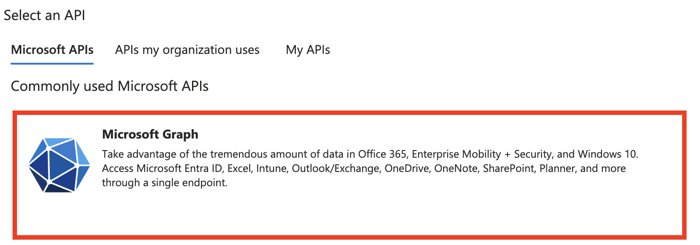
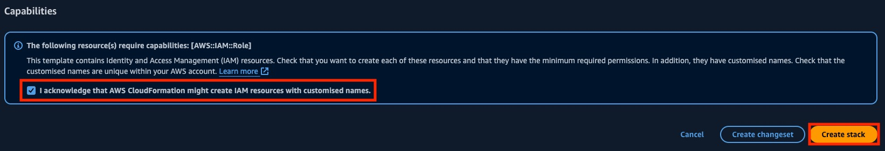
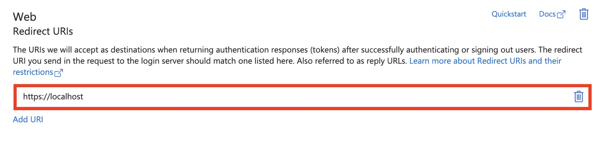
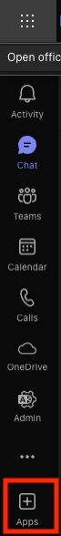

# Integrating Amazon Q Business with Microsoft Teams using Microsoft Entra ID

## Contributors

- Bartosz Wieciech
- Md Arshad Ahmed


## Prerequisites

- Microsoft Business 365 account and access to the Azure cloud tied with it
- IAM Identity Center enabled in the AWS account
- Amazon Q Business application created
- Ability to run CloudFormation scripts


## Values template

During the process you will have to note down several values. Because it is easy to mix up which one is which, this
template is meant to be an aid for you to keep track of them. Values will be referenced both by name, as well
highlighted with a dedicated colour. Delete the placeholder values, they are there just to show you what types of
strings you should expect.

<b><span style="background-color: rgb(179, 179, 179); color: rgb(0, 0, 0)">AMAZON_Q_APP_ID</span></b>: c6dd7f1c-6f...<br>
<b><span style="background-color: rgb(255, 155, 153); color: rgb(0, 0, 0)">OIDC_SECRET</span></b>: ~op8Q~h_hjID3-HGWu...<br>
<b><span style="background-color: rgb(255, 175, 1); color: rgb(0, 0, 0)">OIDC_URL</span></b>: https://login.microsoftonline.com/8f...5/v2.0<br>
<b><span style="background-color: rgb(8, 160, 194); color: rgb(0, 0, 0)">OIDC_CLIENT_ID</span></b>: 9d881ada-5882-4fcc...<br>
<b><span style="background-color: rgb(44, 171, 32); color: rgb(0, 0, 0)">TTI_ARN</span></b>: arn:aws:sso::...:trustedTokenIssuer/ssoins-.../tti-a498f458...<br>
<b><span style="background-color: rgb(145, 65, 8)">GATEWAY_IDC_ARN</span></b>: arn:aws:sso::...:application/ssoins-.../apl-00702...<br>
<b><span style="background-color: rgb(255, 63, 255); color: rgb(0, 0, 0)">GATEWAY_CLIENT_ID</span></b>: a5cb05c1-ed51-47...<br>
<b><span style="background-color: rgb(152, 139, 1); color: rgb(0, 0, 0)">GATEWAY_TENANT_ID</span></b>: 8f15c65e-f8e5-4b...<br>
<b><span style="background-color: rgb(102, 3, 0)">GATEWAY_SECRET</span></b>: pyd8Q~ZOo_A3...<br>


## Steps

### Note down your Amazon Q app ID

1. In the AWS console, go to _Amazon Q Business_
2. Select the application you wish to integrate with Microsoft Teams<br>
<br>
3. Note down the value of Application ID as **<span style="background-color: rgb(179, 179, 179); color: rgb(0, 0, 0)">AMAZON_Q_APP_ID</span>**<br>
<br>


### Register OIDC in Microsoft Entra ID (ex Active Directory)

1. Open https://portal.azure.com/ and log in using a user with permissions to add new app registrations in
_Microsoft Entra ID_
2. Go to Microsoft Entra ID<br>
<br>
3. Click _+Add_ → _App registration_<br>
<br>
4. Give the OIDC app a name (e.g. _Tutorial-OIDC-Application_). For account type, select _Single tenant_.
For the redirect URL, choose _Web_ and enter a placeholder value (e.g. [https://localhost](https://localhost/)) which
we will later change<br>
<br>
5. Click _Register_<br>
<br>
6. You will be redirected to the page of your newly-created app registration. On the left pane, under _Manage_,
select _Certificates & secrets_<br>
<br>
7. Click _+ Create client secret_<br>
<br>
8. Give the secret a name and time to live and click _Add_<br>
<br>
9. Note down the secret value (**not** Secret ID) under **<span style="background-color: rgb(255, 155, 153); color: rgb(0, 0, 0)">OIDC_SECRET</span>**<br>
<br>
10. In the _Overview_ section of the application (left pane), click on _Endpoints_<br>
<br>
11. Copy the value under _OpenID Connect metadata document_ up to v2.0 (i.e. discard /well-known/openid-configuration),
and write it down under **<span style="background-color: rgb(255, 175, 1); color: rgb(0, 0, 0)">OIDC_URL</span>**<br>
<br>
12. On the left pane, select _Authentication_<br>
<br>
13. Scroll to the _Implicit grant and hybrid flows_ section and select _ID tokens (used for implicit and hybrid flows)_.
Confirm by clicking _Save_<br>
<br>
14. In the Overview section of the OIDC application, note down the value of _Application (client) ID_ under
**<span style="background-color: rgb(8, 160, 194); color: rgb(0, 0, 0)">OIDC_CLIENT_ID</span>**


### Create trusted token issuer in IAM Identity Center

1. Open a terminal through which you are able to interact with the relevant AWS account (e.g. by generating temporary
security credentials). Clone [this Git repository](https://github.com/aws-samples/amazon-q-teams-gateway) by running:
    ```
    git clone https://github.com/aws-samples/amazon-q-teams-gateway.git
    ```
2. Change the directory to the cloned repository by running:
    ```
    cd amazon-q-teams-gateway
    ```
3. Run the following lines:
    ```
    export AWS_DEFAULT_REGION='<YOUR AWS REGION>'
    export OIDC_ISSUER_URL='**OIDC_URL**'
    ./bin/create-trusted-token-issuer.sh $OIDC_ISSUER_URL
    ```
4. The output of the script will be a value in the form of **TTI_ARN=arn:aws:sso...** which you should note down under
**<span style="background-color: rgb(44, 171, 32); color: rgb(0, 0, 0)">TTI_ARN</span>** *without* the TTI_ARN= prefix (i.e. you should note
down arn:aws:sso...)
5. Run the following commands, replacing **<span style="background-color: rgb(44, 171, 32); color: rgb(0, 0, 0)">TTI_ARN</span>** and
**<span style="background-color: rgb(8, 160, 194); color: rgb(0, 0, 0)">OIDC_CLIENT_ID</span>** with their respective values
    ```
    export TTI_ARN='**TTI_ARN**'
    export OIDC_CLIENT_ID='**OIDC_CLIENT_ID**'
    ./bin/create-idc-application.sh $OIDC_CLIENT_ID $TTI_ARN
    ```
6. You should see an output similar to the below:
    > Created GATEWAY_IDC_ARN: arn:aws:sso::...:application/ssoins-.../apl-00702... is setup with GATEWAY_IDC_ARN:
    > arn:aws:sso::...:application/ssoins-.../apl-00702...
7. Note down the value of **<span style="background-color: rgb(145, 65, 8)">GATEWAY_IDC_ARN</span>**


### Register the Microsoft Teams Gateway in Microsoft Entra ID (ex Active Directory)

1. Open https://portal.azure.com/ and log in using a user with permissions to add new app registrations in Microsoft
Entra ID
2. Go to _Microsoft Entra ID_<br>
<br>
3. Click _+Add_ → _App registration_<br>
<br>
4. Give the OIDC app a name (e.g. _Tutorial-Amazon-Q-Teams-Gateway_). For account type, select _Single tenant_. For the
redirect URL. Leave other fields unchanged. Confirm by clicking _Register_.<br>
<br>
5. You will be redirected to the page of your newly-created application. Note down the values of _Application (client)
ID_ as **<span style="background-color: rgb(255, 63, 255); color: rgb(0, 0, 0)">GATEWAY_CLIENT_ID</span>**, and _Directory (tenant) ID_ as
**<span style="background-color: rgb(152, 139, 1); color: rgb(0, 0, 0)">GATEWAY_TENANT_ID</span>**.

6. On the left pane, select _API permissions_<br>
<br>
7. Click _+ Add a permission_<br>
<br>
8. Click _Microsoft Graph_<br>
<br>
9. Click _Application permissions_<br>
<br>
10. Select the following permissions:
    * User.Read.All
    * ChannelMessage.Read.All
    * Team.ReadBasic.All
    * Files.Read.All
11. Confirm by clicking _Add permissions_<br>
<br>
12. Remove the _User.Read_ delegated permission (**not** _User.Read.All_, which you have just added) by clicking "..."
→ _Remove permission_. Confirm when prompted.<br>
<br>
<br>
13. Click _Grant admin consent for <your organization’s name>_. Confirm when prompted. Green ticks should appear, for
the permissions you have added, in the status column.<br>
<br>
<br>
<br>
14. On the left pane, under _Manage_, select _Certificates & secrets_<br>
<br>
15. Click _+ New client secret_<br>
<br>
16. Give the secret a name and time to live and click _Add_<br>
<br>
17. Note down the secret value (_not_ Secret ID) under **<span style="background-color: rgb(102, 3, 0)">GATEWAY_SECRET</span>**<br>
<br>


### Deploy CloudFormation stack

1. Make sure you are logged in to the appropriate AWS account and have permissions necessary to run CloudFormation
2. Click on the [following link](https://us-east-1.console.aws.amazon.com/cloudformation/home?region=us-east-1#/stacks/create/review?templateURL=https://s3.us-east-1.amazonaws.com/aws-ml-blog-us-east-1/artifacts/amazon-q-teams-gateway/AmazonQTeamsGateway.json&stackName=AMAZON-Q-TEAMS-GATEWAY)
3. Configure the parameters as following:
    - **Stack name**: e.g. _AMAZON-Q-TEAMS-GATEWAY_
    - **AmazonQAppId**: value of **<span style="background-color: rgb(179, 179, 179); color: rgb(0, 0, 0)">AMAZON_Q_APP_ID</span>**
    - **AmazonQRegion**: whichever region you are using, e.g. _us-east-1_
    - **ContextDaysToLive**: (default: 90) number of days to keep the conversation context
    - **GatewayIdcAppARN**: value of **<span style="background-color: rgb(145, 65, 8)">GATEWAY_IDC_ARN</span>**
    - **MicrosoftAppId**: value of **<span style="background-color: rgb(255, 63, 255); color: rgb(0, 0, 0)">GATEWAY_CLIENT_ID</span>**
    - **OIDCClientId**: value of **<span style="background-color: rgb(8, 160, 194); color: rgb(0, 0, 0)">OIDC_CLIENT_ID</span>**
    - **OIDCIdPName**: type _Other_
    - **OIDCIssuerURL**: value of **<span style="background-color: rgb(255, 175, 1); color: rgb(0, 0, 0)">OIDC_URL</span>**

    <br>
4. Acknowledge the capabilities and click _Create stack_. Grab a coffee and wait until the creation process has finished
(takes ~10 minutes).<br>
<br>
5. After the stack is created, go to _Outputs_ and copy the value of the key ending with
_OIDCCallbackEndpointExportedName_<br>
<br>
6. Open https://portal.azure.com/ and go to the OIDC application registration page (e.g. _Tutorial-OIDC-Application_)
7. Click on the value next to Redirect URIs<br>
<br>
8. Change the placeholder you have created in the
[Register OIDC in Microsoft Entra ID (ex Active Directory)](#register-oidc-in-microsoft-entra-id-ex-active-directory)
section to the URL you have copied:
    - **BEFORE**<br>
    <br>
    - **AFTER** (your URL will differ)<br>
    <br>
9. Hit _Save_<br>
<br>


### Updating Secrets in the AWS console

1. In the Outputs tab of your stack, click on the value associated with _...TeamsSecretConsoleUrl_<br>
<br>
2. Under _Secret value_, select _Retrieve secret value_<br>
<br>
3. Click _Edit_<br>
<br>
4. Fill in the following values and hit _Save_:
    - **MicrosoftAppId**: value of **<span style="background-color: rgb(255, 63, 255); color: rgb(0, 0, 0)">GATEWAY_CLIENT_ID</span>**
    - **MicrosoftAppPassword**: value of **<span style="background-color: rgb(102, 3, 0)">GATEWAY_SECRET</span>**
    - **MicrosoftAppTenantId**: value of **<span style="background-color: rgb(152, 139, 1); color: rgb(0, 0, 0)">GATEWAY_TENANT_ID</span>**

   
5. In the Outputs tab of your stack, click on the value associated with _...OIDCClientSecretConsoleUrl_<br>
<br>
6. Retrieve and edit secret values
7. Set **OIDCClientSecret** to the value of **<span style="background-color: rgb(255, 155, 153); color: rgb(0, 0, 0)">OIDC_SECRET</span>** and hit
_Save_<br>
<br>


### Register bot

1. From the output of your CloudFormation stack creation process, copy the value associated with
_...TeamsEventHandlerApiEndpoint..._<br>
<br>
2. Go to https://dev.botframework.com/bots/new and log in using your MS account
3. Fill in the necessary values:
    - **Display name**
    - **Bot handle**: A bot handle represents a bot's registration with the online Azure AI Bot Service and cannot be changed
    - **Messaging endpoint**: paste the value copied from the first point, i.e. the one associated with
      _...TeamsEventHandlerApiEndpoint..._
    - Change the _App type_ to _Single Tenant_
    - For _Paste your app ID below to continue_, paste the value of **<span style="background-color: rgb(255, 63, 255); color: rgb(0, 0, 0)">GATEWAY_CLIENT_ID</span>**
    - For _App Tenant ID_, paste the value of **<span style="background-color: rgb(152, 139, 1); color: rgb(0, 0, 0)">GATEWAY_TENANT_ID</span>**

4. Select the checkbox to acknowledge the terms and click _Register_<br>
<br>
5. You will be redirected to the page of your bot. You must connect it to the MS Teams channel. This can either be
present in the _Add a featured channel_ section, or in _More channels_<br>
<br>
6. For messaging, you are likely to select _Microsoft Teams Commercial_. Hit _Save_.<br>
<br>
7. Select the checkbox to acknowledge the terms and click the _Agree_ button<br>
<br>


### Register Microsoft Teams application

1. Go to https://dev.teams.microsoft.com/ and log in using an account with permissions to add MS Teams apps
2. Go to the _Apps_ tab<br>
<br>
3. Click _+ New app_<br>
<br>
<br>
4. Give the app a name. **The name must be globally unique**. Hit the _Add_ button (yes, the colour may appear as if it
was inactive, especially when using dark mode `:)`)<br>
<br>
5. Do not change the App ID. For obligatory fields like _Short description_, _Long description_, _Developer or company
name_, _Website_, _Privacy policy_ and _Terms of use_ fill in your customer’s details, or use placeholders if you’re
just playing around.<br>
<br>
6. For the _Application (client) ID_, fill the value of **<span style="background-color: rgb(255, 63, 255); color: rgb(0, 0, 0)">GATEWAY_CLIENT_ID</span>**
and hit _Save_<br>
<br>
7. Under _Configure_ → _App features_ on the left pane, select _Bot_<br>
<br>
8. In _Identify your bot_, select _Enter a bot ID_ and paste the value of **<span style="background-color: rgb(255, 63, 255); color: rgb(0, 0, 0)">GATEWAY_CLIENT_ID</span>**.
For _What can your bot do?_, select _Upload and download files_. For Select the scopes where people can use your bot,
select _Personal_, _Team_ and _Group Chat_ (or fewer scopes, if you wish). Save the changes.<br>
<br>
9. Click on _Publish_ in the top-right corner. Then select _Download the app package_.<br>
<br>
<br>
10.  Open your Microsoft Teams application or go to https://teams.microsoft.com/
11.  On the left pane, choose _Apps_<br>
<br>
12.  From the bottom-left, choose _Manage your apps_, and upload an app<br>
<br>
<br>
13.  Choose _Upload an app to your organisation’s app catalogue_<br>
<br>
14. Select the app package you have previously downloaded
15. After the app is uploaded, click _Add_ next to the application name. A popup will appear. Click _Add_ again.<br>
<br>
<br>
16.  You can now start chatting with Amazon Q (make sure you have synced the data sources and/or allowed reverting to
the LLM’s internal knowledge). Your first message will result in an option to authenticate.<br>
<br>
